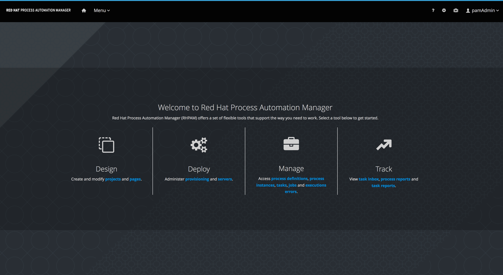
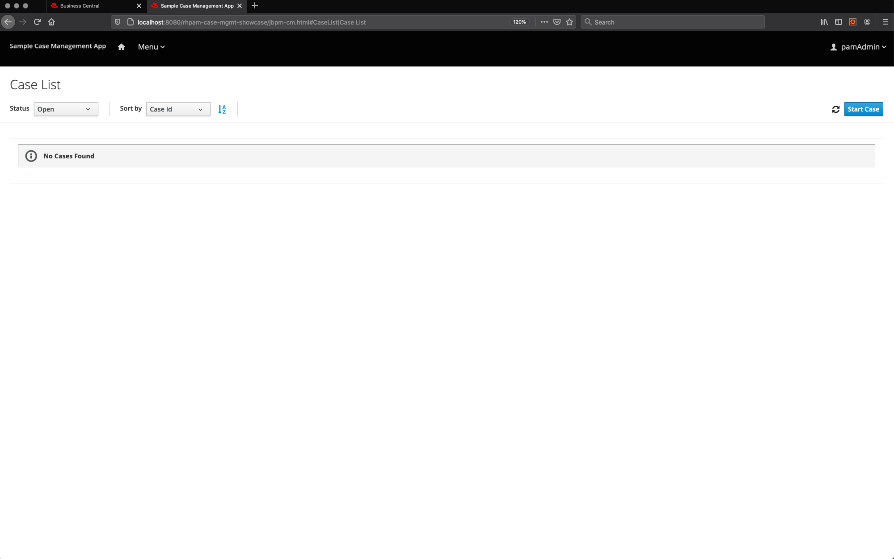

Red Hat Process Automation Manager 7 Install Demo
=================================================
Project to automate the installation of this product without preconfiguration beyond a single admin user.

You can install this project on your own machine or on an OpenShift Container Platform.

Installing on local machine
---------------------------
1. [Download and unzip](https://github.com/jbossdemocentral/rhpam7-install-demo/archive/master.zip) or [clone this repo](https://github.com/jbossdemocentral/rhpam7-install-demo.git).
   
2. Add products to installs directory, see [installs/README](installs/README) for details and links.

3. Run 'init.sh' or 'init.bat' file. 'init.bat' must be run with Administrative privileges.

Follow install output instructions and log in to http://localhost:8080/business-central (u:pamAdmin / p:redhatdm1!)

Enjoy the installed and configured Red Hat Process Automation Manager 7. If you need more help, see the [install video](https://youtu.be/x6U8CiPU9cU).

Installing on OpenShift Container Platform (CodeReady Containers)
----------------------------------------------------------------
Install this demo on your local machine using an OpenShift Container Platform development cluster can be done using 
CodeReady Continers. It's fully automated and delivers a fully functioning container-native development experience:

[Code Ready Containers Red Hat Process Automation Easy Install](https://gitlab.com/redhatdemocentral/rhcs-rhpam-install-demo)

Installing on any OpenShift Container Platform (generic)
-------------------------------------------------------
This demo can be installed on your own version of OpenShift Container Platform. Options and guidance can be found 
in [openshift support directory README](support/openshift/README.md).

Supporting Articles
-------------------
- [Video - Red Hat Process Automation Manager Install Demo](https://youtu.be/x6U8CiPU9cU)

- [CodeReady Containers - Getting Started with OpenShift 4.5 and Process Automation Tooling](https://dzone.com/articles/codeready-containers-getting-started-with-openshif-1)

- [Getting Started with Red Hat Process Automation Manager 7](https://upload.wikimedia.org/wikipedia/commons/6/67/Learning_Curve_--_Coming_Soon_Placeholder.png)

Released versions
-----------------
See the tagged releases for the following versions of the product:

- v1.11 - Red Hat Process Automation Manager 7.10.0.GA
- v1.10 - Red Hat Process Automation Manager 7.9.0.GA
- v1.9 - Red Hat Process Automation Manager 7.8.0.GA
- v1.8 - Red Hat Process Automation Manager 7.7.0.GA
- v1.7 - Red Hat Process Automation Manager 7.5.0.GA
- v1.6 - Red Hat Process Automation Manager 7.4.0.GA
- v1.5 - Red Hat Process Automation Manager 7.3.0.GA
- v1.4 - Red Hat Process Automation Manager 7.3.0.GA
- v1.3 - Red Hat Process Automation Manager 7.1.0.GA
- v1.2 - Red Hat Process Automation Manager 7.0.2.GA
- v0.8 - Red Hat Process Automation Manager 7.0.0.ER2

